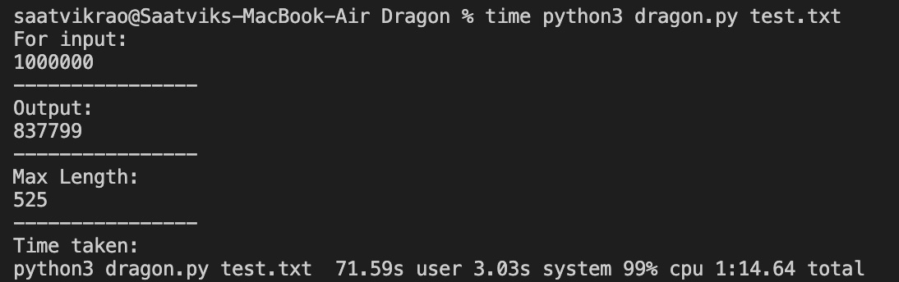

# Problem 14

We have implemented two approaches for the problem - brute force and dynammic programming. Both the approaches give the correct outputs. The only difference is that DP approach is far more optimized than brute force. 

## Instructions 
- Choose the approach you want to run. We recommend using the DP approach. 
- Copy the code from the file `dp.txt` inside `/euler_project\problem14` to the file `test.txt`. 
- Change the variable `inp` to desired input to which you want to know the starting number with longest chain. 
    - You can choose from `{100, 1000, 10000, 100000, 1000000}`. 
- To simply get the output, run "`python3 dragon.txt test.txt`". To get the running time also, run "`time python3 dragon.txt test.txt`". 

## Comparision 
Brute force takes a lot more time than the DP approach because it is not optmimised. For input of `1,000,000`, time take by brute force was more than `20 mins`, whereas using DP we could output the result in nearly `1.25 mins`. 

For brute force approach: 

 

 

For DP approach: 

## Brute force approach completed in given time frame

In brute force approach we calculated time by running programme on resolved ast done after first evaluation. It takes less than 4 min for $10^5$ value. 

 

## Approaches
The variable `inp` is defined to specify the range in which want to find out starting number with the longest chain. 

Variable `max_length` stores the maximum length of chain. 

Variable `max_start` stores the starting number with the longest chain. 

Loop through all the numbers from `1` to `inp`. Find the length of chain for each number by calling the function `func` and update `max_length` and `max_start` if the length is found to be bigger than maximum length till then, `max_length`. 

### **Brute Force** Approach: 
For each number, we apply iterative approach to find the length of chain. We will loop till we don't reach `1` in the chain, and keep updating `n` according to given conditions. We also store the number of iterations which is the length of the chain in variable `len`, and return this at the end of the function. 

### **Dynammic Programming** Approach: 
Here, we don't recalculate the length of chains for already calculated numbers. So, we initialize an array `dp`. This stores chain lengths till `1000000` only. 

We also make some changes in out function `func`. First, check if we have reached the end of the chain using `n == 1` and return if true. Next, check if we have already computed the length of chain for `n` and return that length if true. If not true, we recusively call `func` according to conditions given. Update the `dp` array with the found chain length and return that value. 

## Conclusion

Our code works for each input and produces the output within 5 minutes. 