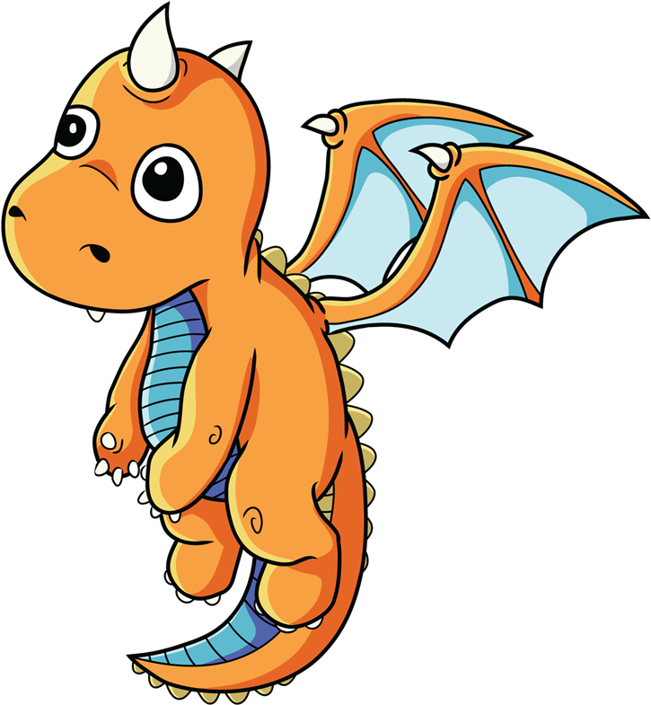

# **Compiler-Project**

## **Project Overview**
Our team is building a compiler from scratch using the Python programming language. The goal of this project is to create a full-featured compiler that can handle the complete compilation process, including lexical analysis, parsing, semantic analysis, and optimization. This compiler project will serve as a comprehensive learning experience for our team, as we will be implementing all the features from scratch. We will be utilizing the latest techniques in compiler design and construction, ensuring that our compiler is efficient, scalable, and easy to use.

The target language for our compiler will be a high-level programming language in our project we are calling it dragon, and we are evaluating with and without bytecode generation. Output given by parser can be run on variety of platforms. Our compiler will support advanced features such as error handling, making it suitable for both academic and commercial use.

In addition to its technical capabilities, our compiler will also have a user-friendly interface, allowing even non-technical users to easily compile their code and run their programs. This will make our compiler accessible to a wider range of users, and provide an excellent learning opportunity for anyone interested in compilers and computer languages. Our team is committed to delivering a high-quality product, and we are confident that our compiler will meet the needs of its users.

## **Language specifications**

We will provide these informations on every layer of our compiler. We will provide example codes for users to explain language's features.

## **Architecture**

For the whole project we only used python 3.10. 

## **Documentations of different layers of the compiler**

[Scanner](docs/SCANNER.md) - tokenizing user given text file.

[Parser](docs/PARSER.md) - making AST tree for compiler.

[Interpreter](docs/INTERPRETER.md) - evaluating AST tree.

[Environment](docs/ENVIRONMENT.md) - data structure for binding value to its variables.

## **Reference**

[Crafting Interpreter](https://craftinginterpreters.com/contents.html) - Robert Nystrom